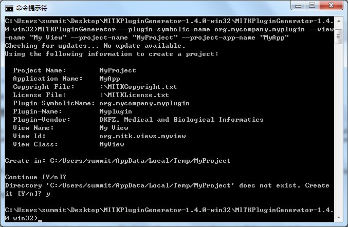

如何使用BundleGenerator创建MITK插件
=================================

MITK插件生成器（BundleGenerator）是一个用于简化创建你的MITK项目（可选）或是插件的命令行工具。它可以在[这里](http://www.mitk.org/wiki/Download)下载或是从已编译的MITK工程中找到。

插件生成器的命令行参数描述如下：

	./MITKPluginGenerator -h
	A CTK plug-in generator for MITK (version 1.2.0)
	
	  -h, --help                      Show this help text
	  -o, --out-dir                   Output directory (default: /tmp)
	  -l, --license                   Path to a file containing license information (default: :/MITKLicense.txt)
	  -v, --vendor                    The vendor of the generated code (default: DKFZ, Medical and Biological Informatics)
	  -q, --quiet                     Do not print additional information
	  -y, --confirm-all               Answer all questions with 'yes'
	  -u, --check-update              Check for updates and exit
	  -n, --no-networking             Disable all network requests
	
	Plug-in View options
	  -vc, --view-class               The View's' class name
	  -vn, --view-name              * The View's human readable name
	
	Plug-in options
	  -ps, --plugin-symbolic-name   * The plugin's symbolic name
	  -pn, --plugin-name              The plug-in's human readable name
	
	Project options
	  --project-copyright             Path to a file containing copyright information (default: :/LICENSE.txt)
	  --project-name                  The project name
	  --project-app-name              The application name
	
	[* - options are required]

> 当然，你也可以给-h命令行参数，在你的控制台输出上述帮助信息

如果通过`-project-name`参数提供一个项目名，那么新的插件将作为新项目的一部分生成。

创建一个新的MITK创建
------------------
这里是一个使用插件生成器的例子，创建一个插件，它的符号名为`com.mycompany.myplugin`而视图名为`My View`:

	./MITKPluginGenerator --plugin-symbolic-name org.mycompany.myplugin --view-name "My View"

> 下图为译者在本机上执行上述命令的结果图

